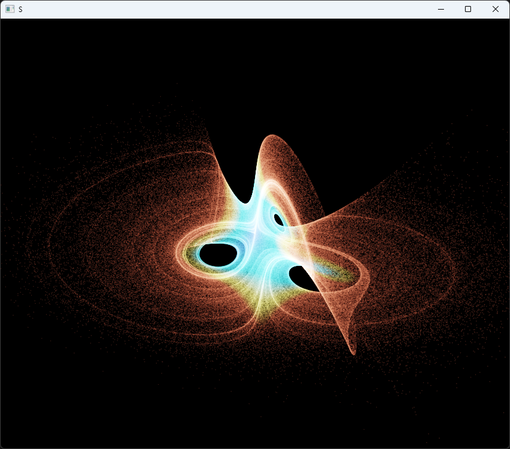

# Strange Attractors — GPU particle visualizer

A real-time visualizer of chaotic dynamical systems. Roughly one million particles
are integrated **entirely on the GPU** through eight classic strange attractors
(Lorenz, Aizawa, Thomas, Halvorsen, Dadras, Chen-Lee, Rössler, Lorenz-84) and
rendered as additive point sprites coloured by velocity.

Written in pure C# with **zero external dependencies** — no OpenTK, no GLFW,
no GLM. The Win32 window, the WGL context and every OpenGL 3.3 Core entry point
are bound by hand via P/Invoke.



## Highlights

- **GPU integration via transform feedback.** Each frame the update program reads
  particle positions from one buffer, performs a classic 4th-order Runge–Kutta
  step of the selected ODE inside a vertex shader, and writes the new state into a
  second buffer. The two buffers ping-pong; the CPU never touches the positions
  after seeding. This keeps ~1M particles animating at vsync with the integrator
  running on the GPU.
- **RK4 in GLSL.** The right-hand sides of all eight systems live in a single
  `deriv()` switch in the shader. Particles that diverge or hit `NaN` are
  respawned near the system's centre using an in-shader hash, so the cloud stays
  alive indefinitely.
- **Raw WGL bootstrap.** A throwaway legacy context is created only to reach
  `wglCreateContextAttribsARB`, which then produces a 3.3 Core profile context.
  Modern entry points are resolved through `wglGetProcAddress` with a fallback to
  `GetProcAddress` on `opengl32.dll`.
- **Hand-rolled math.** Column-major 4×4 matrices, `LookAt`/`Perspective` and an
  orbit camera, no third-party linear algebra.
- **HDR rendering with ACES tone mapping.** Particles accumulate additively into
  an `RGBA16F` framebuffer; a full-screen pass then applies exposure, ACES filmic
  tone mapping and gamma. This is what keeps a million overlapping additive points
  from collapsing into a flat white blob — dense cores stay bright but keep their
  colour and structure. Exposure is adjustable live.
- **Velocity-mapped palette** with additive (`GL_ONE, GL_ONE`) blending for a
  glowing, volumetric look.

## Architecture

| File | Responsibility |
|------|----------------|
| `Program.cs`   | Window, WGL context bootstrap, main loop, input, orbit camera |
| `Win32.cs`     | Win32 / GDI / WGL P/Invoke declarations and structs |
| `Gl.cs`        | OpenGL 3.3 Core loader and managed wrappers; shader/program build |
| `Renderer.cs`  | Double-buffered particle system, transform-feedback step, HDR target, tone-map pass |
| `Shaders.cs`   | GLSL: RK4 update shader and the point-sprite render shaders |
| `Attractors.cs`| Per-system metadata (dt, escape radius, seed cloud, camera framing) |
| `Mat.cs`       | `Vec3` and column-major matrix helpers |

The ODEs themselves are defined in `Shaders.UpdateVs`; `Attractors.All` carries
only the host-side parameters and must stay index-aligned with the shader's
`switch`. Adding a new attractor is two edits: a branch in `deriv()` and a row in
the table.

## Controls

| Input | Action |
|-------|--------|
| `Space` / `Backspace` | next / previous attractor |
| `1` … `8` | select attractor directly |
| Left-drag | orbit camera |
| Mouse wheel | zoom |
| `A` | toggle auto-rotation |
| `R` | reseed the particle cloud |
| `P` | pause / resume integration |
| `+` / `-` | exposure |
| `Esc` | quit |

## Build & run

Requires the .NET SDK (8.0+) and a Windows GPU/driver exposing OpenGL 3.3 Core.

```
dotnet run -c Release
```

or open `StrangeAttractors.sln` in Visual Studio 2022 and run (x64).

## Notes on numerics

Each system uses a fixed RK4 step sized to its dynamics (`Attractor.Dt`), with two
sub-steps per frame for smoothness. Parameters are the canonical literature values.
Seeding is a random box around each system's centre; for dissipative chaotic flows
nearly every trajectory is drawn onto the strange attractor within a fraction of a
second, which is what fills out the characteristic shapes.

## License

MIT.

## Support

If you found this project interesting or useful, you can support my work:

[](https://github.com/sponsors/makarov-mm)